# 🎤🤖 Copilot Studio Speech Avatar Assistant

> **A cutting-edge real-time speech-to-speech avatar system** combining Azure AI Services, Microsoft Copilot Studio, and advanced WebRTC streaming for natural conversational AI experiences.

[](https://gydjv2-cbd8hma6fvcuedh5.eastasia-01.azurewebsites.net/)
[](https://reactjs.org/)
[](https://www.typescriptlang.org/)
[](https://azure.microsoft.com/en-us/services/cognitive-services/speech-services/)
[](https://gydjv2-cbd8hma6fvcuedh5.eastasia-01.azurewebsites.net/)

---

## 🌟 **What Makes This Special**

This isn't just another chatbot – it's a **next-generation conversational AI system** that delivers human-like interactions through:

- 🎯 **Real-time speech recognition** with automatic language detection
- 🤖 **Microsoft Copilot Studio bot integration** for intelligent responses  
- 👤 **Live video avatar** that speaks responses with perfect lip-sync
- 🌐 **WebRTC streaming** for ultra-low latency video delivery
- 🔄 **Continuous conversation flow** with automatic listening management
- 🌍 **Multilingual support** with dynamic language switching
- ⚡ **Performance-optimized** for real-time interactions

---

## 🏗️ **System Architecture**

```mermaid
graph TB
    A[🎤 User Speech] --> B[Azure Speech SDK]
    B --> C[Text Recognition]
    C --> D[🤖 Copilot Studio Bot]
    D --> E[Direct Line API]
    E --> F[Bot Response]
    F --> G[Azure Avatar Real-Time API]
    G --> H[👤 Live Video Avatar]
    H --> I[🔊 Speech Synthesis]
    I --> J[📺 WebRTC Stream]
    J --> K[🌐 User Browser]
    
    style A fill:#ff9999
    style D fill:#99ccff
    style G fill:#99ff99
    style K fill:#ffcc99
```



### **Data Flow Pipeline**
1. **🎤 Speech Input** → Azure Speech SDK converts speech to text via continuous recognition
2. **🧠 AI Processing** → Copilot Studio bot processes the text via Direct Line API and generates intelligent responses
3. **👤 Avatar Generation** → Azure Avatar Real-Time API creates live video with speech synthesis using SSML
4. **🌐 Real-time Delivery** → WebRTC streams the avatar video with synchronized audio and lip-sync

### **Technical Implementation Flow**

```typescript
// 1. Speech Recognition → Bot Message
User Speech → SpeechService.startRecognition() → BotService.sendMessage()

// 2. Bot Response → Avatar Speech
BotService (receives response) → emits 'botResponse' event → App.tsx (handles event) 
→ AzureAvatarRealTimeService.speakWithAutoVoice() → Avatar speaks with lip-sync
```

---

## 🎯 **Core Features**

### **🎤 Advanced Speech Recognition**
- **Continuous Recognition**: Always listening for natural conversation flow
- **Multilingual Auto-Detection**: Supports 10+ languages with real-time switching
- **Language Intelligence**: Automatic voice selection based on detected language
- **Noise Cancellation**: Optimized for various acoustic environments
- **Real-time Feedback**: Live transcription with immediate visual feedback

### **🤖 Intelligent Bot Integration**
- **Microsoft Copilot Studio**: Full integration with advanced conversational AI
- **Direct Line API**: Real-time WebSocket communication
- **Context Awareness**: Maintains conversation context and history
- **Rich Responses**: Supports text, cards, and multimedia content
- **Custom Logic**: Easily extendable with custom bot behaviors

### **👤 Live Avatar Experience**
- **Real-time Video**: Live avatar generation with WebRTC streaming
- **Perfect Lip-sync**: Synchronized speech synthesis and facial animation
- **Multiple Characters**: Choose from various avatar personas (Lisa, etc.)
- **Custom Styles**: Different poses and presentation styles
- **Adaptive Quality**: Dynamic quality adjustment based on connection

### **🌐 Modern Web Technology**
- **React 19**: Latest React with concurrent features
- **TypeScript**: Full type safety and IntelliSense support
- **Vite**: Lightning-fast development and building
- **Express Server**: Production-ready Node.js backend
- **Azure Deployment**: Multiple deployment options (Web Apps, Container Apps, Static Web Apps)

### **🔧 Developer Experience**
- **Comprehensive Diagnostics**: Built-in debugging and troubleshooting tools
- **Real-time Monitoring**: Performance metrics and connection status
- **Error Handling**: Graceful error recovery and user feedback
- **Configuration Management**: Environment-based configuration with validation
- **Hot Reload**: Instant development feedback

---

## 🚀 **Quick Start Guide**

### **Prerequisites**

- **Node.js** 18+ and npm
- **Azure Subscription** with Speech Services
- **Microsoft Copilot Studio** bot with Direct Line channel
- **Azure Avatar Real-Time API** access (preview feature)

### **Installation**

```bash
# Clone the repository
git clone https://github.com/yourusername/copilot-studio-speech-avatar.git
cd copilot-studio-speech-avatar

# Install dependencies
npm install

# Copy environment template
cp .env.example .env

# Configure your credentials (see configuration section)
nano .env

# Start development server
npm run dev
```

### **Environment Configuration**

Create a `.env` file with your Azure credentials:

```bash
# 🔑 Azure Speech Services (Required)
VITE_SPEECH_KEY=your_speech_subscription_key
VITE_SPEECH_REGION=eastus
VITE_SPEECH_ENDPOINT=https://your-speech-resource.cognitiveservices.azure.com/

# 🤖 Bot Framework Direct Line (Required)
VITE_DIRECTLINE_SECRET=your_directline_secret

# 👤 Azure Avatar Real-Time API (Required)
VITE_AVATAR_SUBSCRIPTION_KEY=your_avatar_subscription_key
VITE_AVATAR_REGION=eastus
VITE_AVATAR_ENDPOINT=https://your-avatar-resource.cognitiveservices.azure.com/

# 🎨 Avatar Customization (Optional)
VITE_AVATAR_CHARACTER=lisa
VITE_AVATAR_STYLE=casual-sitting
VITE_AVATAR_VOICE=en-US-AvaMultilingualNeural
```

---

## 📋 **Detailed Configuration**

### **Required Services Setup**

#### **1. Azure Speech Services**
```bash
# Create Speech resource
az cognitiveservices account create \
  --name "my-speech-service" \
  --resource-group "my-rg" \
  --kind "SpeechServices" \
  --sku "S0" \
  --location "eastus"

# Get keys
az cognitiveservices account keys list \
  --name "my-speech-service" \
  --resource-group "my-rg"
```

#### **2. Microsoft Copilot Studio Bot**
1. Create bot in [Copilot Studio](https://copilotstudio.microsoft.com/)
2. Configure Direct Line channel
3. Copy the secret key
4. Ensure bot is published and accessible

#### **3. Azure Avatar Real-Time API**
- Request access to the preview feature
- Use same Speech Services resource
- Ensure region supports Avatar API (limited regions)

### **Configuration Reference**

| Environment Variable | Description | Required | Example |
|---------------------|-------------|----------|---------|
| `VITE_SPEECH_KEY` | Azure Speech subscription key | ✅ | `abc123def456...` |
| `VITE_SPEECH_REGION` | Azure Speech region | ✅ | `eastus` |
| `VITE_SPEECH_ENDPOINT` | Speech Services endpoint | ✅ | `https://eastus.api.cognitive.microsoft.com/` |
| `VITE_DIRECTLINE_SECRET` | Bot Direct Line secret | ✅ | `xyz789abc123...` |
| `VITE_AVATAR_SUBSCRIPTION_KEY` | Avatar API key | ✅ | `def456ghi789...` |
| `VITE_AVATAR_REGION` | Avatar API region | ✅ | `eastus` |
| `VITE_AVATAR_ENDPOINT` | Avatar API endpoint | ✅ | `https://eastus.api.cognitive.microsoft.com/` |
| `VITE_AVATAR_CHARACTER` | Avatar character name | ❌ | `lisa`, `casual` |
| `VITE_AVATAR_STYLE` | Avatar pose/style | ❌ | `casual-sitting`, `graceful-sitting` |
| `VITE_AVATAR_VOICE` | Default voice for synthesis | ❌ | `en-US-AvaMultilingualNeural` |

### **Avatar Character Options**

| Character | Description | Styles Available |
|-----------|-------------|------------------|
| `lisa` | Professional female avatar | `casual-sitting`, `graceful-sitting` |
| `casual` | Casual male avatar | `casual-sitting`, `standing` |

### **Voice Options (Multilingual)**

| Voice Name | Languages | Best For |
|-----------|-----------|----------|
| `en-US-AvaMultilingualNeural` | 29 languages | Global applications |
| `en-US-JennyNeural` | English | Professional settings |
| `zh-CN-XiaoxiaoNeural` | Chinese | Chinese market |

---

## 🎮 **User Guide**

### **Basic Usage**

1. **🌐 Access the Application**
   - Open your browser to the deployed URL
   - Ensure microphone permissions are granted
   - Wait for avatar session to initialize

2. **🎤 Start Conversation**
   - Click "Start Listening" to begin speech recognition
   - Speak naturally - the system detects multiple languages
   - Watch real-time transcription of your speech

3. **🤖 Bot Interaction**
   - Your speech is sent to the Copilot Studio bot
   - Bot responses appear in conversation history
   - Avatar speaks the response with lip-sync

4. **🔄 Continuous Flow**
   - System automatically manages listening states
   - Pauses listening when avatar speaks
   - Resumes listening after avatar finishes

### **Advanced Features**

#### **🌍 Language Switching**
- Toggle between "English Only" and "Multilingual" modes
- System automatically detects spoken language
- Avatar responds with appropriate voice and accent

#### **🔧 Diagnostics and Troubleshooting**
- **Debug Microphone**: Test microphone setup and permissions
- **Performance Metrics**: Monitor system performance
- **Connection Status**: Real-time service connection monitoring
- **Error Logging**: Detailed error information and solutions

#### **⚙️ Settings Configuration**
- Runtime configuration changes
- Service credential updates
- Avatar customization options
- Voice and language preferences

---

## 🛠️ **Development Guide**

### **Project Structure**

```
copilot-studio-speech-avatar/
├── 📁 src/
│   ├── 📁 components/           # React UI components
│   │   ├── AzureAvatarPlayer.tsx       # Main avatar video player
│   │   ├── ConversationHistory.tsx     # Chat history display
│   │   ├── AvatarTroubleshooting.tsx   # Diagnostic tools
│   │   ├── SettingsModal.tsx           # Configuration UI
│   │   └── UIComponents.tsx            # Reusable UI elements
│   ├── 📁 services/             # Core business logic
│   │   ├── ConfigService.ts             # Configuration management
│   │   ├── SpeechService.ts             # Azure Speech SDK wrapper
│   │   ├── BotService.ts                # Direct Line API integration
│   │   ├── AzureAvatarRealTimeService.ts # Avatar real-time API
│   │   ├── AvatarService.ts             # Avatar management
│   │   ├── FallbackAvatarService.ts     # Fallback mechanisms
│   │   ├── HybridAvatarService.ts       # Hybrid avatar modes
│   │   ├── LiveAvatarService.ts         # Live avatar features
│   │   └── InitializationService.ts     # Service initialization
│   ├── 📁 types/                # TypeScript definitions
│   │   └── index.ts                     # All type definitions
│   ├── App.tsx                  # Main application component
│   ├── main.tsx                 # React application entry
│   └── 📁 assets/               # Static assets
├── 📁 public/                   # Public static files
├── 📁 infra/                    # Azure infrastructure as code
│   ├── main.bicep                       # Main Bicep template
│   ├── main.parameters.json             # Parameter values
│   └── abbreviations.json               # Resource naming
├── 📁 .github/workflows/        # CI/CD pipelines
│   ├── main_gydjv2.yml                 # Azure Web App deployment
│   ├── container-apps-deploy.yml       # Container Apps deployment
│   ├── swa-deploy.yml                  # Static Web Apps deployment
│   └── azd-deploy.yml                  # Azure Developer CLI deployment
├── server.js                    # Express.js production server
├── package.json                 # NPM dependencies and scripts
├── tsconfig.json               # TypeScript configuration
├── vite.config.ts              # Vite build configuration
└── README.md                   # This comprehensive guide
```

### **Development Scripts**

```bash
# 🚀 Development
npm run dev              # Start development server with hot reload
npm run build            # Build for production
npm run preview          # Preview production build locally
npm run lint             # Run ESLint code analysis

# 🔧 Production
npm start                # Start production server
npm run start:prod       # Start with production environment

# 🧪 Testing & Quality
npm run lint             # Code quality checks
npm run type-check       # TypeScript type checking
```

### **Key Service Classes**

#### **🎤 SpeechService**
```typescript
class SpeechService {
  // Continuous multilingual speech recognition
  startRecognition(onRecognizing, onRecognized, onError)
  
  // Speech synthesis with voice selection
  synthesizeSpeech(text, voice, language)
  
  // Microphone diagnostics
  debugMicrophoneSetup()
  
  // Language detection and management
  getDetectedLanguageInfo()
}
```

#### **🤖 BotService**
```typescript
class BotService {
  // Direct Line WebSocket connection
  connect()
  
  // Send message to bot
  sendMessage(text)
  
  // Handle bot responses
  onBotResponse(callback)
  
  // Connection management
  dispose()
}
```

#### **👤 AzureAvatarRealTimeService**
```typescript
class AzureAvatarRealTimeService {
  // Start WebRTC avatar session
  startSession(character, style)
  
  // Speak text with avatar
  speak(text, voice)
  
  // Auto voice selection based on language
  speakWithAutoVoice(text, language)
  
  // Session management
  stopSession()
}
```

#### **⚙️ ConfigService**
```typescript
class ConfigService {
  // Singleton pattern for global configuration
  static getInstance()
  
  // Configuration validation
  validateConfiguration()
  
  // Runtime updates
  updateSettings(newSettings)
  
  // Service-specific configs
  getSpeechConfig()
  getBotConfig()
  getAvatarConfig()
}
```

### **State Management Architecture**

The application uses React hooks and context for state management:

```typescript
// Main application state
interface AppState {
  isListening: boolean;
  isProcessing: boolean;
  isConnected: boolean;
  currentMessage: string;
  botResponse: string;
  error?: string;
}

// Conversation management
const [conversationHistory, setConversationHistory] = useState<BotMessage[]>([]);

// Avatar state
const [isAvatarSpeaking, setIsAvatarSpeaking] = useState(false);
const [isAvatarSessionActive, setIsAvatarSessionActive] = useState(false);

// Language and interaction state
const [isMultiLingual, setIsMultiLingual] = useState(false);
const [isMicrophoneMuted, setIsMicrophoneMuted] = useState(false);
```

---

## 🚀 **Deployment Options**

### **1. Azure Web App (Recommended)**

Automatic deployment via GitHub Actions:

```yaml
# .github/workflows/main_gydjv2.yml
name: Deploy to Azure Web App
on:
  push:
    branches: [main]
jobs:
  deploy:
    steps:
      - name: Build and Deploy
        uses: azure/webapps-deploy@v3
```

**Features:**
- ✅ Automatic HTTPS with SSL certificates
- ✅ Custom domain support
- ✅ Built-in monitoring and logs
- ✅ Auto-scaling capabilities
- ✅ Easy environment variable management

### **2. Azure Container Apps**

For containerized deployment:

```yaml
# .github/workflows/container-apps-deploy.yml
name: Deploy to Container Apps
```

**Features:**
- ✅ Kubernetes-based scaling
- ✅ Microservices architecture ready
- ✅ Event-driven scaling
- ✅ Built-in service mesh

### **3. Azure Static Web Apps**

For static hosting with serverless API:

```yaml
# .github/workflows/swa-deploy.yml
name: Deploy to Static Web Apps
```

**Features:**
- ✅ Global CDN distribution
- ✅ Serverless API functions
- ✅ Authentication integration
- ✅ Cost-effective for low traffic

### **4. Local Development**

```bash
# Start all services locally
npm run dev

# Production build locally
npm run build && npm run preview
```

### **Infrastructure as Code**

Deploy complete infrastructure with Bicep:

```bash
# Deploy infrastructure
az deployment group create \
  --resource-group my-rg \
  --template-file infra/main.bicep \
  --parameters @infra/main.parameters.json
```

The Bicep template includes:
- 🏗️ Azure App Service Plan
- 🌐 Azure Web App with custom domain
- 🔑 Azure Key Vault for secrets
- 📊 Application Insights for monitoring
- 🔐 Managed Identity for secure access

---

## 🔒 **Security & Best Practices**

### **Security Features**

- **🔐 Credential Management**: All secrets stored as environment variables
- **🌐 HTTPS Enforcement**: Automatic HTTPS redirection in production
- **🛡️ Content Security Policy**: Strict CSP for XSS protection
- **🔑 Azure Managed Identity**: Secure service-to-service authentication
- **📝 CORS Configuration**: Proper cross-origin resource sharing
- **🔒 Permissions Policy**: Explicit microphone permission management

### **Best Practices Implemented**

```javascript
// Security headers in server.js
app.use((req, res, next) => {
  res.setHeader('Strict-Transport-Security', 'max-age=31536000; includeSubDomains');
  res.setHeader('X-Content-Type-Options', 'nosniff');
  res.setHeader('X-Frame-Options', 'DENY');
  res.setHeader('Permissions-Policy', 'microphone=(self)');
  res.setHeader('Content-Security-Policy', '...');
});
```

### **Privacy Considerations**

- **🎤 Microphone Access**: Explicit user consent required
- **📝 Data Processing**: Speech data processed in real-time, not stored
- **🌐 Regional Compliance**: Respects data residency requirements
- **🔄 Session Management**: Automatic cleanup of sensitive data

---

## 📊 **Performance Optimization**

### **Real-time Performance Features**

- **⚡ Ultra-low Latency**: Optimized for sub-second response times
- **🔄 Continuous Recognition**: Eliminates start/stop delays
- **📱 Adaptive Quality**: Dynamic quality adjustment based on connection
- **🎯 Smart Debouncing**: Prevents duplicate message processing
- **💾 Efficient Memory Usage**: Optimized object lifecycle management

### **Monitoring and Metrics**

```typescript
// Built-in performance monitoring
const performanceMetrics = {
  speechRecognitionLatency: number;
  botResponseTime: number;
  avatarRenderingDelay: number;
  webrtcConnectionQuality: RTCStatsReport;
};
```

### **Optimization Techniques**

1. **Speech Recognition Optimization**
   - Reduced debounce timeouts (150ms)
   - Optimized language detection
   - Microphone keep-alive for instant response

2. **Avatar Rendering Optimization**
   - Minimal DOM manipulations during video playback
   - Deferred non-critical event emissions
   - Optimized WebRTC stream handling

3. **Network Optimization**
   - WebSocket connection pooling
   - Efficient message serialization
   - Adaptive streaming quality

---

## 🔍 **Troubleshooting Guide**

### **Common Issues & Solutions**

#### **🎤 Microphone Not Working**

**Symptoms**: No speech recognition, permission denied errors

**Solutions**:
```bash
# Check HTTPS requirement
- Ensure app is accessed via HTTPS (required for microphone)
- Check browser console for permission errors
- Use Debug Microphone button for diagnostics

# Browser-specific fixes
Chrome: chrome://settings/content/microphone
Firefox: about:preferences#privacy
Safari: Preferences > Websites > Microphone
```

#### **👤 Avatar Not Appearing**

**Symptoms**: Black video area, connection errors

**Solutions**:
```bash
# Check credentials
- Verify VITE_AVATAR_SUBSCRIPTION_KEY is correct
- Ensure VITE_AVATAR_REGION matches your resource
- Confirm Avatar API access is enabled

# Network troubleshooting
- Check WebRTC connection in browser DevTools
- Verify firewall allows WebRTC traffic
- Test with different network connection
```

#### **🤖 Bot Not Responding**

**Symptoms**: Messages sent but no bot responses

**Solutions**:
```bash
# Bot configuration
- Verify VITE_DIRECTLINE_SECRET is valid
- Check bot is published in Copilot Studio
- Ensure Direct Line channel is enabled

# Connection debugging
- Monitor WebSocket connection in DevTools
- Check bot logs in Copilot Studio
- Verify bot endpoint is accessible
```

### **Diagnostic Tools**

#### **Built-in Diagnostics**

```typescript
// Use the diagnostic modal
- Click "🔧 Diagnostics" button
- Run "🔍 Debug Microphone" test
- Check "🚀 Performance" metrics
- Review connection status indicators
```

#### **Browser Developer Tools**

```bash
# Console commands for debugging
console.log('Speech config:', speechService.getConfig());
console.log('Bot connection:', botService.getConnectionState());
console.log('Avatar session:', avatarService.getSessionInfo());
```

#### **Network Debugging**

```bash
# WebRTC connection diagnostics
chrome://webrtc-internals/  # Chrome
about:webrtc               # Firefox
```

### **Error Codes Reference**

| Error Code | Description | Solution |
|------------|-------------|----------|
| `SPEECH_001` | Invalid subscription key | Check VITE_SPEECH_KEY |
| `SPEECH_002` | Region mismatch | Verify VITE_SPEECH_REGION |
| `BOT_001` | Direct Line connection failed | Check VITE_DIRECTLINE_SECRET |
| `BOT_002` | Bot not responding | Verify bot is published |
| `AVATAR_001` | Session initialization failed | Check avatar credentials |
| `AVATAR_002` | WebRTC connection error | Check network/firewall |
| `MIC_001` | Microphone permission denied | Enable microphone in browser |
| `MIC_002` | HTTPS required | Access app via HTTPS |

---

## 🧪 **Testing & Quality Assurance**

### **Testing Strategy**

```bash
# Manual testing checklist
□ Microphone permission and speech recognition
□ Bot conversation flow
□ Avatar video and speech synthesis
□ Language switching functionality
□ Error handling and recovery
□ Performance under various conditions
□ Cross-browser compatibility
□ Mobile device testing
```

### **Performance Testing**

```typescript
// Built-in performance monitoring
const testPerformance = () => {
  // Speech recognition latency
  const speechLatency = measureSpeechRecognitionTime();
  
  // Bot response time
  const botLatency = measureBotResponseTime();
  
  // Avatar rendering delay
  const avatarLatency = measureAvatarRenderingTime();
  
  // Overall system performance
  const systemPerformance = calculateOverallPerformance();
};
```

### **Browser Compatibility**

| Browser | Version | Speech | Avatar | WebRTC | Status |
|---------|---------|--------|--------|--------|--------|
| Chrome | 90+ | ✅ | ✅ | ✅ | Full Support |
| Firefox | 88+ | ✅ | ✅ | ✅ | Full Support |
| Safari | 14+ | ✅ | ✅ | ⚠️ | Limited WebRTC |
| Edge | 90+ | ✅ | ✅ | ✅ | Full Support |
| Mobile Chrome | Latest | ✅ | ✅ | ✅ | Full Support |
| Mobile Safari | Latest | ✅ | ⚠️ | ⚠️ | Limited Features |

---

## 📚 **API Reference**

### **Configuration API**

```typescript
interface ConfigService {
  // Validate all configurations
  validateConfiguration(): {
    isValid: boolean;
    errors: string[];
  };
  
  // Get service-specific configurations
  getSpeechConfig(): SpeechConfig;
  getBotConfig(): BotConfig;
  getAvatarConfig(): AvatarConfig;
  getMultiLingualConfig(): MultiLingualConfig;
  
  // Runtime updates
  updateSettings(settings: Partial<DynamicConfig>): void;
}
```

### **Speech Service API**

```typescript
interface SpeechService {
  // Start continuous speech recognition
  startRecognition(
    onRecognizing: (text: string) => void,
    onRecognized: (text: string) => void,
    onError: (error: string) => void
  ): Promise<void>;
  
  // Stop speech recognition
  stopRecognition(): Promise<void>;
  
  // Check microphone permissions
  checkMicrophonePermission(): Promise<boolean>;
  
  // Diagnostic utilities
  debugMicrophoneSetup(): Promise<DiagnosticResult>;
  
  // Language detection
  getDetectedLanguageInfo(): LanguageInfo;
}
```

### **Bot Service API**

```typescript
interface BotService {
  // Connect to Direct Line
  connect(): Promise<void>;
  
  // Send message to bot
  sendMessage(text: string): Promise<void>;
  
  // Dispose connection
  dispose(): void;
  
  // Get connection state
  getConnectionState(): ConnectionState;
}
```

### **Avatar Service API**

```typescript
interface AzureAvatarRealTimeService {
  // Session management
  startSession(
    character: string,
    style: string,
    videoElementId?: string
  ): Promise<void>;
  
  stopSession(): Promise<void>;
  
  // Speech synthesis
  speak(text: string, voice: string): Promise<void>;
  
  speakWithAutoVoice(
    text: string,
    language?: string
  ): Promise<void>;
  
  // Session info
  getSessionInfo(): AvatarSessionInfo;
}
```

---

## 🌍 **Internationalization & Localization**

### **Supported Languages**

| Language | Code | Voice | Auto-Detection | Status |
|----------|------|-------|----------------|--------|
| English (US) | `en-US` | `en-US-AvaMultilingualNeural` | ✅ | Full Support |
| Spanish | `es-ES` | `es-ES-ElviraNeural` | ✅ | Full Support |
| French | `fr-FR` | `fr-FR-DeniseNeural` | ✅ | Full Support |
| German | `de-DE` | `de-DE-KatjaNeural` | ✅ | Full Support |
| Italian | `it-IT` | `it-IT-ElsaNeural` | ✅ | Full Support |
| Portuguese | `pt-BR` | `pt-BR-FranciscaNeural` | ✅ | Full Support |
| Chinese | `zh-CN` | `zh-CN-XiaoxiaoNeural` | ✅ | Full Support |
| Japanese | `ja-JP` | `ja-JP-NanamiNeural` | ✅ | Full Support |
| Korean | `ko-KR` | `ko-KR-SunHiNeural` | ✅ | Full Support |
| Hindi | `hi-IN` | `hi-IN-SwaraNeural` | ✅ | Full Support |

### **Language Configuration**

```typescript
// Enable multilingual mode
const multiLingualConfig = {
  autoDetect: true,
  primaryLanguage: 'en-US',
  supportedLanguages: [
    'en-US', 'es-ES', 'fr-FR', 'de-DE', 'it-IT',
    'pt-BR', 'zh-CN', 'ja-JP', 'ko-KR', 'hi-IN'
  ]
};
```

### **Localization Features**

- **🌐 Automatic Language Detection**: Real-time speech language detection
- **🎙️ Voice Matching**: Automatic voice selection based on detected language
- **🔄 Dynamic Switching**: Seamless language switching mid-conversation
- **📝 UI Localization**: Interface text adapts to detected language
- **🎭 Avatar Localization**: Cultural and linguistic avatar behaviors

---

## 🔗 **External Dependencies & Licenses**

### **Core Dependencies**

| Package | Version | License | Purpose |
|---------|---------|---------|---------|
| `react` | 19.1.0 | MIT | UI framework |
| `typescript` | 5.8.3 | Apache-2.0 | Type safety |
| `vite` | 7.0.0 | MIT | Build tool |
| `express` | 4.18.2 | MIT | Server framework |
| `microsoft-cognitiveservices-speech-sdk` | 1.44.1 | Microsoft | Speech services |
| `botframework-directlinejs` | 0.15.6 | MIT | Bot integration |
| `@azure/identity` | 4.10.1 | MIT | Azure authentication |

### **Development Dependencies**

| Package | Version | License | Purpose |
|---------|---------|---------|---------|
| `@vitejs/plugin-react` | 4.5.2 | MIT | React Vite integration |
| `eslint` | 9.29.0 | MIT | Code linting |
| `typescript-eslint` | 8.34.1 | MIT | TypeScript ESLint |

### **Azure Services Used**

- **Azure Speech Services**: Speech-to-text, text-to-speech, and avatar generation
- **Azure Avatar Real-Time API**: Live video avatar with WebRTC
- **Azure App Service**: Web application hosting
- **Azure Key Vault**: Secure credential storage
- **Application Insights**: Monitoring and diagnostics

---

## 🤝 **Contributing**

### **Contributing Guidelines**

We welcome contributions! Please follow these guidelines:

1. **🍴 Fork the Repository**
   ```bash
   git fork https://github.com/yourusername/copilot-studio-speech-avatar
   ```

2. **🌿 Create Feature Branch**
   ```bash
   git checkout -b feature/amazing-feature
   ```

3. **✍️ Make Changes**
   - Follow TypeScript best practices
   - Add comprehensive documentation
   - Include unit tests where applicable
   - Ensure accessibility compliance

4. **🧪 Test Changes**
   ```bash
   npm run lint
   npm run build
   npm run test
   ```

5. **📝 Submit Pull Request**
   - Provide detailed description
   - Include screenshots/videos for UI changes
   - Reference relevant issues

### **Development Setup**

```bash
# Clone and setup development environment
git clone https://github.com/yourusername/copilot-studio-speech-avatar.git
cd copilot-studio-speech-avatar

# Install dependencies
npm install

# Setup environment
cp .env.example .env
# Configure your .env file

# Start development
npm run dev
```

### **Code Style Guidelines**

- **TypeScript**: Strict mode enabled, full type coverage
- **ESLint**: Follow configured linting rules
- **Formatting**: Use Prettier for consistent formatting
- **Comments**: Document complex logic and APIs
- **Testing**: Write tests for new features

---

## 📋 **Changelog**

### **Version 1.0.0** (Current)
- ✅ Initial release with full speech-to-speech avatar functionality
- ✅ Azure Speech Services integration
- ✅ Microsoft Copilot Studio bot integration
- ✅ Azure Avatar Real-Time API implementation
- ✅ Multilingual support with auto-detection
- ✅ WebRTC streaming for live avatar video
- ✅ Comprehensive diagnostics and troubleshooting
- ✅ Multiple deployment options (Web App, Container Apps, Static Web Apps)
- ✅ Full TypeScript implementation
- ✅ Modern React 19 with concurrent features

### **Planned Features** (Roadmap)
- 🔄 Enhanced avatar customization options
- 🎨 Additional avatar characters and styles
- 📱 Progressive Web App (PWA) support
- 🔊 Audio effects and voice modulation
- 📊 Advanced analytics and usage metrics
- 🌐 Additional language support
- 🎮 Interactive gesture recognition
- 🤖 Multiple bot integration options

---

## 📄 **License**

This project is licensed under the **MIT License** - see the [LICENSE](LICENSE) file for details.

```
MIT License

Copyright (c) 2025 Copilot Studio Speech Avatar Contributors

Permission is hereby granted, free of charge, to any person obtaining a copy
of this software and associated documentation files (the "Software"), to deal
in the Software without restriction, including without limitation the rights
to use, copy, modify, merge, publish, distribute, sublicense, and/or sell
copies of the Software, and to permit persons to whom the Software is
furnished to do so, subject to the following conditions:

The above copyright notice and this permission notice shall be included in all
copies or substantial portions of the Software.
```

---

## 🙏 **Acknowledgments**

- **Microsoft Azure Team** for providing world-class AI services
- **Microsoft Copilot Studio Team** for conversational AI platform
- **React Team** for the amazing UI framework
- **TypeScript Team** for type safety and developer experience
- **Vite Team** for lightning-fast build tools
- **Open Source Community** for the incredible ecosystem

---

## 📞 **Support & Contact**

### **Getting Help**

- **📖 Documentation**: Read this comprehensive guide
- **🔧 Built-in Diagnostics**: Use the app's diagnostic tools
- **🐛 Issues**: Report bugs on GitHub Issues
- **💬 Discussions**: Join GitHub Discussions for questions
- **📧 Direct Contact**: [your-email@domain.com](mailto:your-email@domain.com)

### **Community Resources**

- **🐦 Twitter**: [@YourHandle](https://twitter.com/yourhandle) - Latest updates
- **📺 YouTube**: [Channel Link](https://youtube.com/channel) - Video tutorials
- **📝 Blog**: [Blog Link](https://yourblog.com) - Technical deep dives
- **💼 LinkedIn**: [Your Profile](https://linkedin.com/in/you) - Professional updates

---

## 🎉 **Ready to Get Started?**

```bash
# Quick start in 3 commands
git clone https://github.com/yourusername/copilot-studio-speech-avatar.git
cd copilot-studio-speech-avatar
npm install && npm run dev
```

**🌟 Star this repository if you found it helpful!**

**🔗 Try the live demo**: [https://gydjv2-cbd8hma6fvcuedh5.eastasia-01.azurewebsites.net/](https://gydjv2-cbd8hma6fvcuedh5.eastasia-01.azurewebsites.net/)

---

*Built with ❤️ by developers who believe in the power of conversational AI*

---

## 🔧 **Technical Deep Dive: Bot Response to Avatar Text-to-Speech**

### **Complete Data Flow Architecture**

```mermaid
sequenceDiagram
    participant User as 👤 User
    participant Speech as 🎤 SpeechService
    participant Bot as 🤖 BotService
    participant App as 📱 App.tsx
    participant Avatar as 👤 AvatarService
    participant Video as 📺 WebRTC Stream

    User->>Speech: Speaks into microphone
    Speech->>App: onRecognized(text)
    App->>Bot: sendMessage(text)
    Bot->>Bot: DirectLine API call
    Bot->>App: emits 'botResponse' event
    App->>Avatar: speakWithAutoVoice(botText)
    Avatar->>Avatar: Creates SSML + selects voice
    Avatar->>Video: Synthesizes speech with lip-sync
    Video->>User: Avatar speaks response
```



### **1. Bot Response Reception (BotService.ts)**

When your Copilot Studio bot sends a response, here's exactly how it's captured:

```typescript
// File: src/services/BotService.ts
private setupActivityListener(): void {
  if (!this.directLine) return;

  this.directLine.activity$.subscribe({
    next: (activity) => {
      console.log('Received activity from bot:', activity);
      
      // Only process messages from the bot (not user messages)
      if (activity.from && activity.from.id !== 'user' && activity.type === 'message') {
        const botMessage: BotMessage = {
          id: activity.id || uuidv4(),
          text: activity.text || '',              // ← THIS IS THE TEXT THAT WILL BE SPOKEN
          from: { 
            id: activity.from.id,
            name: activity.from.name 
          },
          timestamp: new Date(activity.timestamp || Date.now()),
          type: 'bot'
        };

        this.conversationState.messages.push(botMessage);
        
        // 🔥 CRITICAL: This emits the event that triggers avatar speech
        this.emitBotResponse(botMessage);
      }
    }
  });
}

// This is the bridge between bot response and avatar speech
private emitBotResponse(message: BotMessage): void {
  const event = new CustomEvent('botResponse', { detail: message });
  window.dispatchEvent(event);  // ← Triggers App.tsx listener
}
```

### **2. Bot Response to Avatar Connection (App.tsx)**

The main application listens for bot responses and immediately triggers avatar speech:

```typescript
// File: src/App.tsx - Lines 125-155
useEffect(() => {
  const handleBotResponse = async (event: Event) => {
    const customEvent = event as CustomEvent<BotMessage>;
    const botMessage = customEvent.detail;
    
    setAppState(prev => ({
      ...prev,
      botResponse: botMessage.text,    // Update UI state
      isProcessing: false
    }));

    // Update conversation history
    setConversationHistory(prev => [...prev, botMessage]);

    // 🔥 CRITICAL: Immediately speak the bot response using Azure Avatar
    try {
      if (azureAvatarServiceRef.current && botMessage.text.trim()) {
        // Check current avatar state for debugging
        const currentlySpeaking = azureAvatarServiceRef.current.isSpeakingNow();
        const queueLength = azureAvatarServiceRef.current.getQueueLength();
        const deviceId = azureAvatarServiceRef.current.getDeviceSessionId();
        
        if (currentlySpeaking || queueLength > 0) {
          console.log(`🎭 Device ${deviceId} - Avatar busy - Speaking: ${currentlySpeaking}, Queue: ${queueLength}`);
        }
        
        // 🎯 THIS IS WHERE BOT TEXT BECOMES AVATAR SPEECH
        await azureAvatarServiceRef.current.speakWithAutoVoice(botMessage.text, 'en-US');
      }
    } catch (error) {
      setAppState(prev => ({
        ...prev,
        error: `Avatar speech failed: ${error instanceof Error ? error.message : String(error)}`
      }));
      addNotification('Failed to speak response', 'warning');
    }
  };

  // Listen for bot response events
  window.addEventListener('botResponse', handleBotResponse);
  
  return () => {
    window.removeEventListener('botResponse', handleBotResponse);
  };
}, []);
```

### **3. Avatar Text-to-Speech Processing (AzureAvatarRealTimeService.ts)**

Here's the exact process that converts bot text into avatar speech:

```typescript
// File: src/services/AzureAvatarRealTimeService.ts

// Step 1: Auto voice selection based on language
public async speakWithAutoVoice(text: string, detectedLanguage?: string): Promise<void> {
  const language = detectedLanguage || 'en-US';
  const bestVoice = this.getBestVoiceForLanguage(language);  // Selects appropriate voice
  
  await this.speak(text, bestVoice);  // Calls main speak method
}

// Step 2: Main speaking method with queue management
public async speak(text: string, voice?: string): Promise<void> {
  if (!this.avatarSynthesizer || !this.isSessionActive) {
    throw new Error(`Avatar session not started on device ${this.deviceSessionId}`);
  }

  console.log(`🎭 Speak request for device ${this.deviceSessionId} - Current state: speaking=${this.isSpeaking}, queue=${this.speakQueue.length}`);

  // Queue management: Add to queue if avatar is already speaking
  if (this.isSpeaking) {
    console.log(`🎭 Avatar currently speaking, queueing request...`);
    return new Promise((resolve, reject) => {
      this.speakQueue.push({ text, voice, resolve, reject });
      console.log(`📋 Request queued, new queue length: ${this.speakQueue.length}`);
    });
  }

  this.isSpeaking = true;
  console.log(`🎭 Starting to speak:`, text.substring(0, 50) + (text.length > 50 ? '...' : ''));

  try {
    // Step 3: Voice selection and SSML creation
    const selectedVoice = voice || this.configService.getSpeechConfig().synthesisVoice || 'en-US-JennyMultilingualNeural';
    
    // Step 4: Create optimized SSML for speech synthesis
    const ssml = this.createSSML(text, selectedVoice);
    
    // Step 5: Emit speaking started event (for UI updates)
    setTimeout(() => this.emitEvent('speakingStarted', { 
      text, 
      voice: selectedVoice, 
      deviceId: this.deviceSessionId 
    }), 0);

    // Step 6: 🔥 CRITICAL - This is where the magic happens
    // The Azure Avatar Real-Time API synthesizes speech with video
    const result = await this.avatarSynthesizer.speakSsmlAsync(ssml);

    // Step 7: Handle synthesis result
    setTimeout(() => {
      if (result.reason === SpeechSDK.ResultReason.SynthesizingAudioCompleted) {
        this.emitEvent('speakingCompleted', { 
          text, 
          voice: selectedVoice, 
          resultId: result.resultId, 
          deviceId: this.deviceSessionId 
        });
      } else {
        this.emitEvent('speakingError', { 
          error: `Speech synthesis failed: ${result.reason}`, 
          voice: selectedVoice, 
          deviceId: this.deviceSessionId 
        });
      }
    }, 0);

  } catch (error) {
    console.error(`❌ Avatar speaking failed:`, error);
    setTimeout(() => this.emitEvent('speakingError', { 
      error: error instanceof Error ? error.message : String(error), 
      deviceId: this.deviceSessionId 
    }), 0);
    throw error;
  } finally {
    this.isSpeaking = false;
    console.log(`🎭 Finished speaking, queue length: ${this.speakQueue.length}`);
    // Process next item in queue
    this.processNextInQueue();
  }
}

// Step 8: SSML Creation for optimal speech synthesis
private createSSML(text: string, voice: string): string {
  // Ultra-minimal HTML encoding for performance
  const encodedText = text.replace(/[&<>]/g, (char) => {
    return char === '&' ? '&amp;' : char === '<' ? '&lt;' : '&gt;';
  });

  // Minimal SSML for maximum speed - this is what the Azure API receives
  return `<speak version="1.0" xml:lang="en-US"><voice name="${voice}">${encodedText}</voice></speak>`;
}

// Step 9: Voice selection logic
public getBestVoiceForLanguage(languageCode: string): string {
  const availableLanguages = this.configService.getAvailableLanguages();
  const matchedLanguage = availableLanguages.find((lang: any) => lang.code === languageCode);
  
  if (matchedLanguage) {
    console.log(`🗣️ Found voice for ${languageCode}: ${matchedLanguage.voice}`);
    return matchedLanguage.voice;
  }
  
  // Fallback to multilingual voice
  console.log(`🗣️ No specific voice found for ${languageCode}, using multilingual fallback`);
  return 'en-US-JennyMultilingualNeural';
}
```

### **4. Real-time Avatar Video Output**

The avatar video with lip-sync is delivered through WebRTC:

```typescript
// File: src/services/AzureAvatarRealTimeService.ts - WebRTC Setup
private async setupWebRTC(iceServerInfo: any, videoElementId: string): Promise<void> {
  // Create WebRTC peer connection
  this.peerConnection = new RTCPeerConnection({
    iceServers: [{
      urls: [iceServerInfo.url],
      username: iceServerInfo.username,
      credential: iceServerInfo.credential
    }]
  });

  // Handle incoming video stream from Azure Avatar API
  this.peerConnection.ontrack = (event) => {
    console.log('📺 Received WebRTC track:', event.track.kind);
    
    if (event.track.kind === 'video') {
      const videoElement = document.getElementById(videoElementId) as HTMLVideoElement;
      if (videoElement) {
        // 🔥 THIS IS WHERE THE AVATAR VIDEO APPEARS
        videoElement.srcObject = event.streams[0];
        videoElement.autoplay = true;
        videoElement.muted = true; // Initially muted, unmuted after autoplay
        videoElement.volume = 1.0;
        event.track.enabled = true;
        
        // Enable autoplay with unmuting after successful start
        setTimeout(async () => {
          try {
            await videoElement.play();
            // Unmute after successful autoplay for lip-sync audio
            setTimeout(() => {
              videoElement.muted = false;
            }, 800);
          } catch (error) {
            console.log('Audio autoplay blocked, user interaction required');
          }
        }, 100);
      }
    }
  };

  // Start avatar with WebRTC connection
  await new Promise<void>((resolve, reject) => {
    this.avatarSynthesizer!.startAvatarAsync(this.peerConnection!)
      .then((result) => {
        if (result.reason === SpeechSDK.ResultReason.SynthesizingAudioCompleted) {
          console.log('✅ Avatar WebRTC session started successfully');
          resolve();
        } else {
          reject(new Error(`Failed to start avatar: ${result.reason}`));
        }
      })
      .catch(reject);
  });
}
```

### **5. Complete Configuration Chain**

Here's how to configure the entire system:

```typescript
// File: src/services/ConfigService.ts
export default class ConfigService {
  // Bot configuration for Copilot Studio
  getBotConfig(): BotConfig {
    return {
      directLineSecret: import.meta.env.VITE_DIRECTLINE_SECRET  // Your bot's Direct Line secret
    };
  }

  // Speech configuration for Azure Speech Services
  getSpeechConfig(): SpeechConfig {
    return {
      speechKey: import.meta.env.VITE_SPEECH_KEY,              // Azure Speech API key
      speechRegion: import.meta.env.VITE_SPEECH_REGION,        // e.g., "eastus"
      speechEndpoint: import.meta.env.VITE_SPEECH_ENDPOINT,    // Speech service endpoint
      synthesisVoice: 'en-US-JennyMultilingualNeural'          // Default voice
    };
  }

  // Avatar configuration for real-time video
  getAvatarConfig(): AvatarConfig {
    return {
      character: import.meta.env.VITE_AVATAR_CHARACTER || 'lisa',
      style: import.meta.env.VITE_AVATAR_STYLE || 'casual-sitting',
      voice: import.meta.env.VITE_AVATAR_VOICE || 'en-US-JennyMultilingualNeural'
    };
  }
}
```

### **6. Environment Variables Required**

```bash
# Bot Configuration
VITE_DIRECTLINE_SECRET=your_copilot_studio_directline_secret

# Azure Speech Services  
VITE_SPEECH_KEY=your_azure_speech_subscription_key
VITE_SPEECH_REGION=eastus
VITE_SPEECH_ENDPOINT=https://eastus.api.cognitive.services.azure.com/

# Azure Avatar Real-Time API
VITE_AVATAR_SUBSCRIPTION_KEY=your_avatar_subscription_key
VITE_AVATAR_REGION=eastus
VITE_AVATAR_ENDPOINT=https://eastus.api.cognitive.services.azure.com/

# Avatar Customization (Optional)
VITE_AVATAR_CHARACTER=lisa
VITE_AVATAR_STYLE=casual-sitting
VITE_AVATAR_VOICE=en-US-JennyMultilingualNeural
```

### **7. Debugging the Connection**

To debug the bot-to-avatar connection, use these console commands:

```typescript
// Check bot connection status
console.log('Bot connected:', botServiceRef.current?.isConnectedToBoot());

// Check avatar session status  
console.log('Avatar active:', azureAvatarServiceRef.current?.isActive());

// Monitor avatar speaking state
console.log('Avatar speaking:', azureAvatarServiceRef.current?.isSpeakingNow());

// Check avatar queue
console.log('Avatar queue length:', azureAvatarServiceRef.current?.getQueueLength());

// Get detailed avatar debug info
console.log('Avatar debug:', azureAvatarServiceRef.current?.getDebugInfo());
```

### **8. Key Success Factors**

1. **✅ Proper Event Chain**: `BotService` → `botResponse` event → `App.tsx` → `AzureAvatarRealTimeService`
2. **✅ WebRTC Connection**: Avatar video stream must be established before speaking
3. **✅ SSML Processing**: Text is converted to SSML with voice selection
4. **✅ Queue Management**: Multiple bot responses are queued and processed sequentially
5. **✅ Error Handling**: Each step has error handling to prevent system breakdown

### **9. Performance Optimizations**

- **Ultra-fast debouncing**: 150ms timeout for speech recognition to bot processing
- **Minimal SSML**: Optimized SSML generation for reduced latency
- **Queue management**: Prevents overlapping speech synthesis requests
- **Event optimization**: Non-critical events are deferred using `requestIdleCallback`
- **WebRTC streaming**: Real-time video delivery with minimal buffering

This architecture ensures that every word from your Copilot Studio bot is immediately converted into natural avatar speech with perfect lip-sync and minimal latency.
